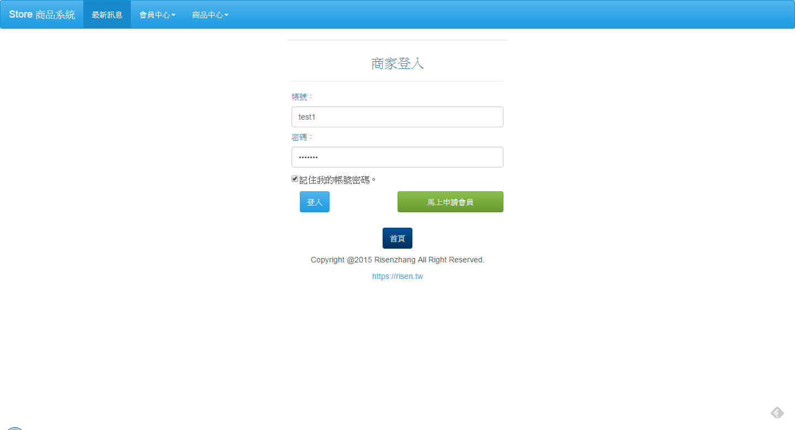
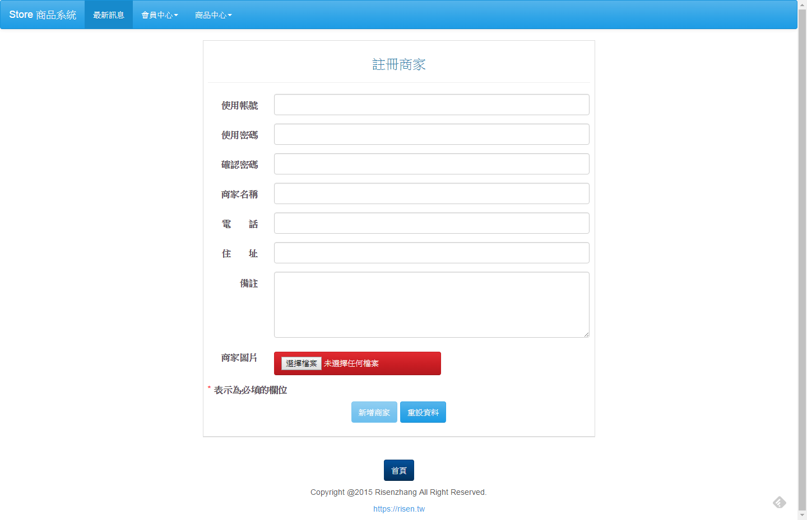
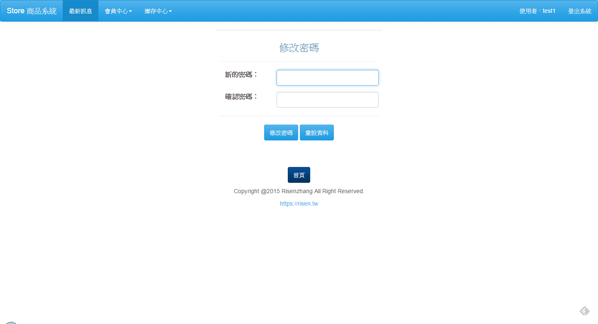
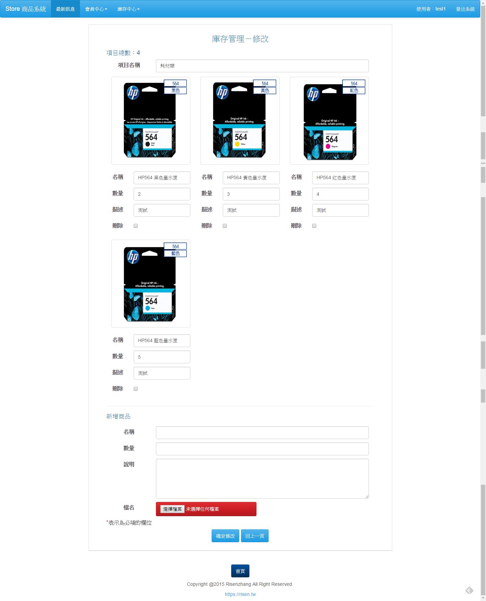
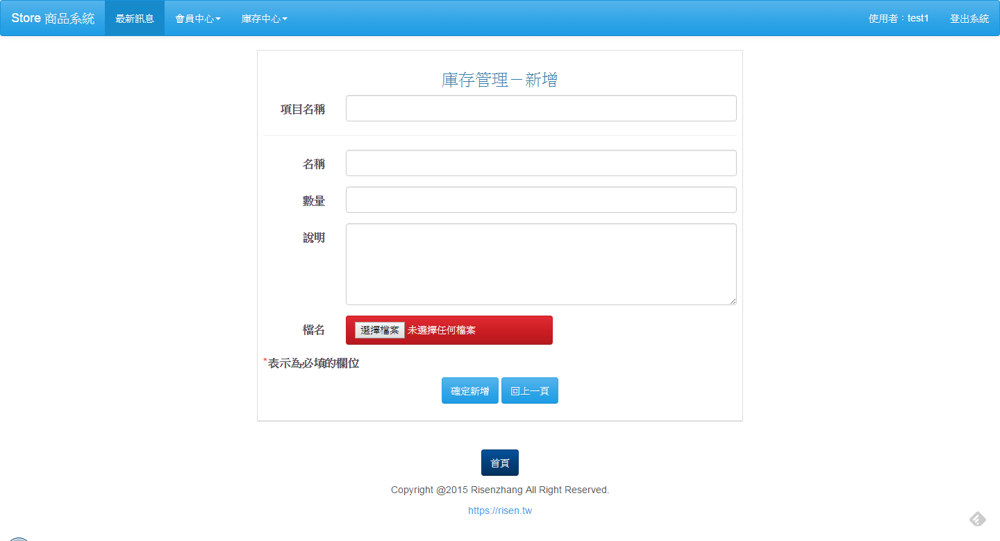
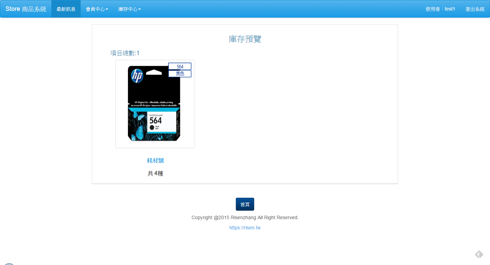
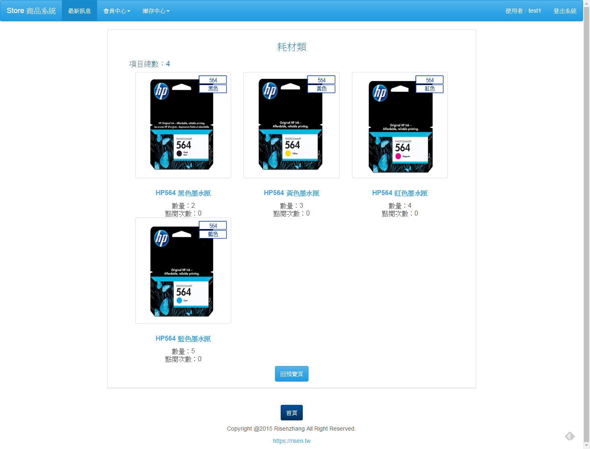
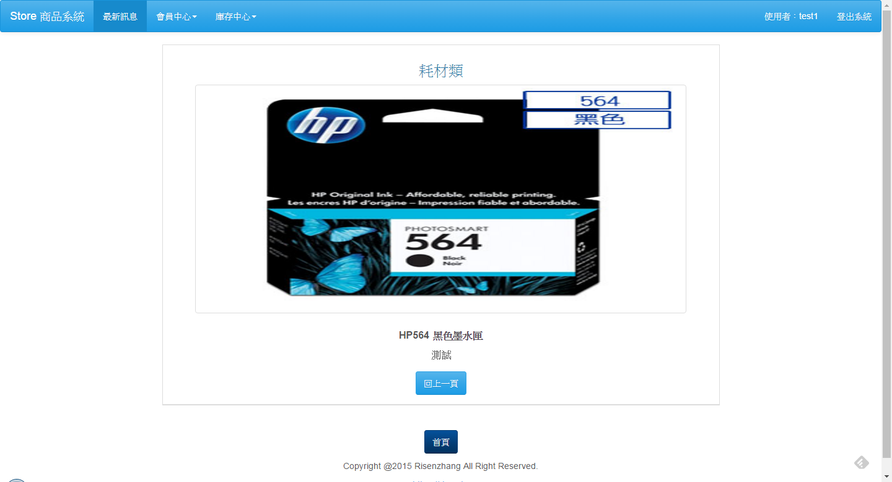

# Store-Management 簡易商家商品管理系統

1. 測試的硬體環境
 - 記憶體：8GB
 - CPU：Intel Core i5 4210U

2. 測試的軟體環境
 - 作業系統：Windows 7 64位
 - 資料庫：MySQL 5.6.20
 - 瀏覽器：Chrome， IE9

3. 測試的網路環境
 - 伺服器：Apache/2.4.10 (Win32) OpenSSL/1.0.1i PHP/5.5.15

4. 系統說明
> 每位會員註冊後都會產生獨立的資料庫，彼此不會互相干擾，而註冊資料則是統一存放在 admin_db 資料庫中，但是每個商家的產品資料都由個別的資料庫獨立管理，除此之外還有使用響應式設計，不同的裝置都會有自適應的功能。
> 

5. 使用說明
> 修改程式中 connMysql.php 檔案對應自己設定的資料庫帳號和密碼，並將readme資料夾底下的資料庫進行匯入，預設建立shop_test1 資料庫，所有的註冊者資訊都會放在 admin_db。
>

6. 網站預覽
 - 登入畫面
 
 - 註冊會員

 - 最新訊息

 - 商家首頁

 - 修改密碼

 - 修改會員資料

 - 管理庫存

 - 修改庫存

 - 新增庫存

 - 庫存預覽

 - 項目預覽

 - 商品預覽

